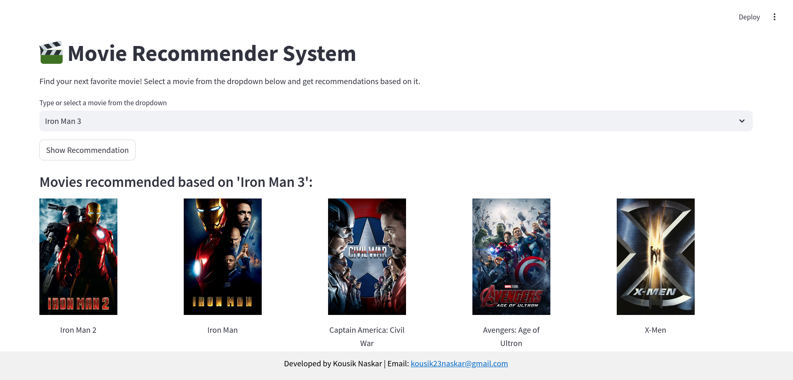

<h1 align="center">🎬 Movie Recommender System Using Machine Learning 🍿</h1> <p align="center">  </p> <p> Welcome to the Movie Recommender System! This repository contains the code and resources to recommend movies based on your preferences using machine learning techniques. 🎥 </p>

## Project Overview 💡
This project employs a collaborative filtering approach to recommend movies. The system analyzes similarities between movies to suggest titles that you might enjoy based on your selection. Users can search for a movie from the dropdown menu and receive personalized recommendations.

## Dataset 📊
The model utilizes the TMDB 5000 dataset available on [Kaggle](https://www.kaggle.com/datasets/tmdb/tmdb-movie-metadata). This dataset containing movie information, including titles, genres, and popularity ratings. The dataset has been processed and saved in a serialized format for efficient retrieval. Each movie is represented with its unique ID, which is used to fetch movie posters from an external API.

## Functionality 🧑🏻‍💻
The application includes several key features:

- **Movie Selection:** Users can choose a movie from a dropdown menu.
- **Recommendations:** Upon selection, the app recommends similar movies based on user input.
- **Movie Posters:** Each recommendation is accompanied by a movie poster for visual reference.

## How It Works 🛠️
- **Movie Selection:** Users select a movie from the dropdown list.
- **Recommendation Generation:** The application retrieves recommendations by finding movies similar to the selected title.
- **Poster Fetching:** Movie posters are fetched from The Movie Database (TMDb) API to enhance the user experience.

## Usage 💪🏻
To run the project locally, follow these steps:

1. **Clone this repository:**
  ```bash
  git clone https://github.com/kousik23naskar/movie-recommender-system.git
  ```
2. **Navigate to the project directory:**
  ```bash
  cd movie-recommender-system
  ```
3. **Create a conda environment:**
  ```bash
  conda create -p venv python=3.9 -y
  ```
4. **Activate the environment:** 
  ```bash
  conda activate ./venv
  ```
5. **Install the necessary dependencies:** 🛠️
  ```bash
  pip install -r requirements.txt
  ```
6. **Run the Streamlit app:** 
  ```bash
  streamlit run app.py
  ``` 
7. Open your web browser and go to the URL provided by **Streamlit** (usually `http://localhost:8501`)

## Results and Discussion 🎯🏆
In this section, we present the results of the movie recommendation experiments. The app effectively suggests movies based on user input, enhancing the movie-watching experience.



- **Performance:**

  - **Accuracy:** The recommendations closely match user preferences based on similarity scores.
  - **User Experience:** The interface is intuitive and engaging.

- **Strengths:**

  - **Personalized Recommendations:** Provides tailored suggestions based on user choices.
  - **Visual Appeal:** Movie posters enrich the presentation of recommendations.

- **Limitations:**

  - **Data Dependency:** Recommendations are limited by the quality and diversity of the dataset.
  - **API Reliance:** Fetching posters requires a valid API key from TMDb.

- **Potential Areas of Improvement:**

  - **Expanded Dataset:** Including more recent movies or user ratings could improve recommendation quality.
  - **User Feedback Mechanism:** Implementing user feedback could refine recommendations over time.

## Contributing 🤝
We welcome contributions to enhance this project. If you have suggestions, bug fixes, or new features, please submit a pull request. Your input is highly appreciated!

## License 🔐
This project is licensed under the [MIT License](LICENSE).

## Contact 📩
For any questions or inquiries, feel free to reach out to us:
- **Email:** kousik23naskar@gmail.com
- **LinkedIn:** [Kousik Naskar](https://www.linkedin.com/in/dr-kousik-naskar/)

Thank you for visiting this project repository. Enjoy movie recommendations! 🎥🍿 😇